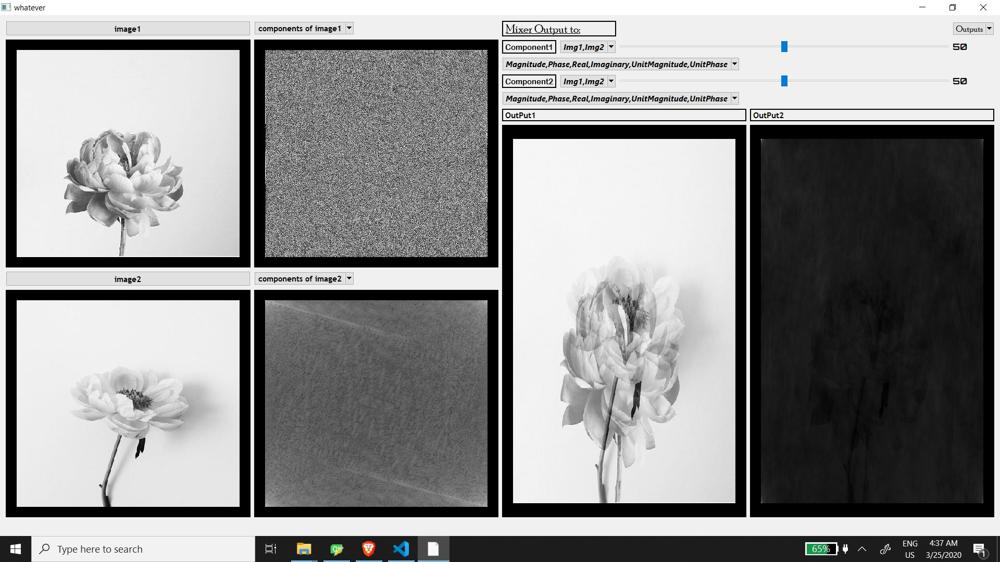
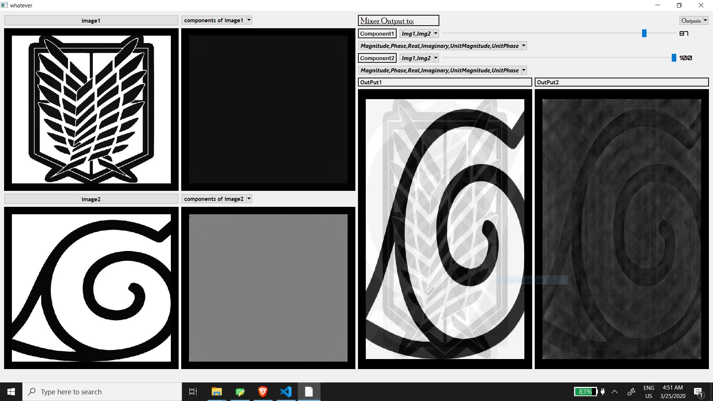
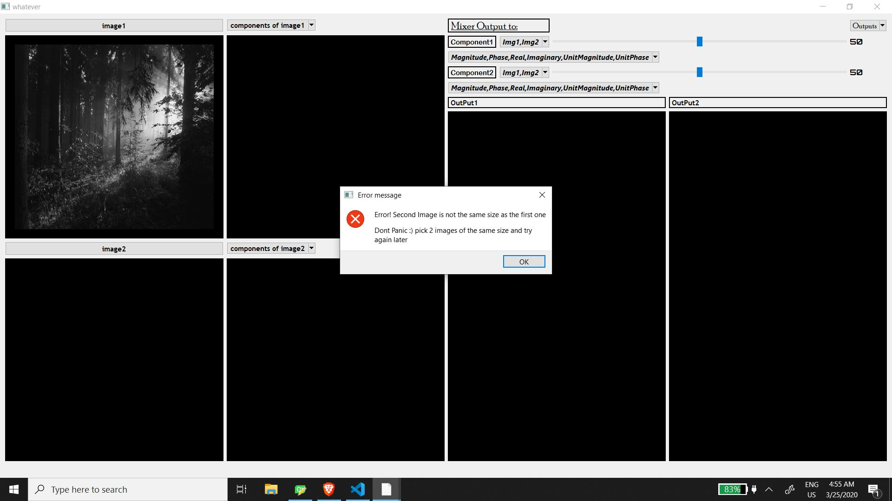
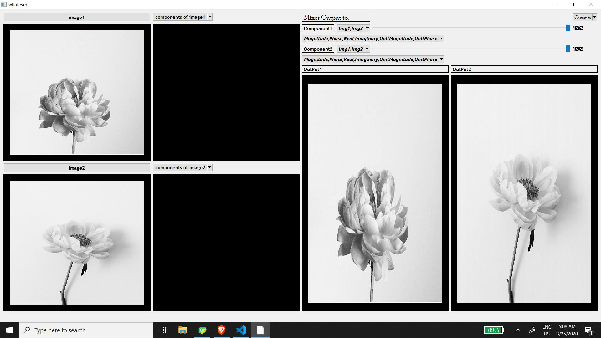
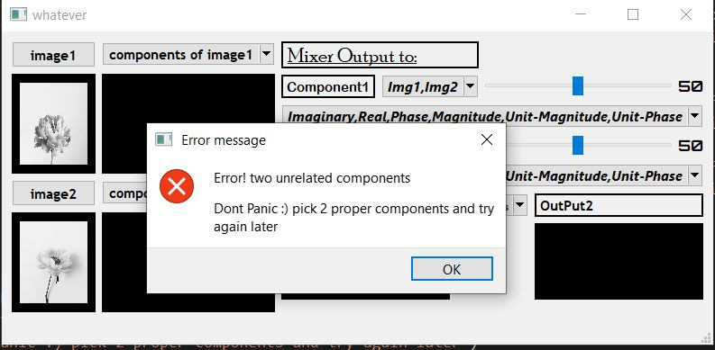
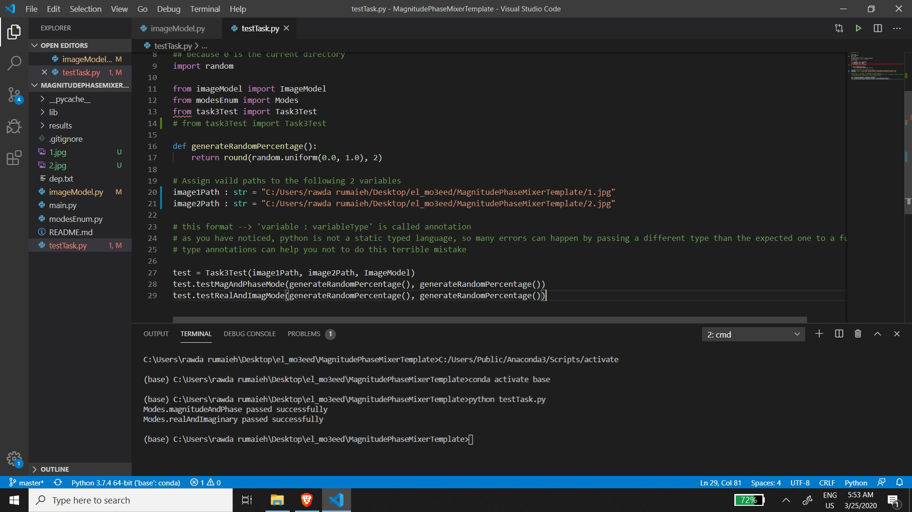

# Wondering how to use it?

* ### first you upload the two images
* ### then you choose from the menu wether you want to apply [fourier magnitude/real/imaginar or phase]
* *  #### you can leave it empty if you like nothing will crash "hopefully"
* ### then you choose in (component1) which image you would like 
* ### choose slider1's value 
* ### choose what to perform on component 1 [long slider]
* ### then you choose in (component2) which image you would like 
* ### choose slider2's value 

* ### choose what to perform on component 2 [long slider]
* ### choose from outputs menu on which output you want to display you result
#

# __some screen shots with the basic features of my program__

# Result 1
* first i uploaded two images with the phase of the first and magnitude of the second
*the left output is the real component of image one with the imaginary component of image two both 50 % slider
*the right output is the phase component of image one with the magnitude component of image two both 50 % slider

#
# Result 2
* real image 1 and imaginary image 2
* the left output is image 1 real 18% and image 2 imaginary 0%
* the right output is image 2 unit magnitude 87% and image2 phase 100 %

# 
# Result 3
choosing two images with different sizes

#
# Result 4
* left output is first image 0% real and 0% imaginary of second image
*the right output is first image 100% real and second image is 100% imaginay

#
# Result 5
choosing two unrelated components (phase+imaginary)

# Passing the test (Y)

